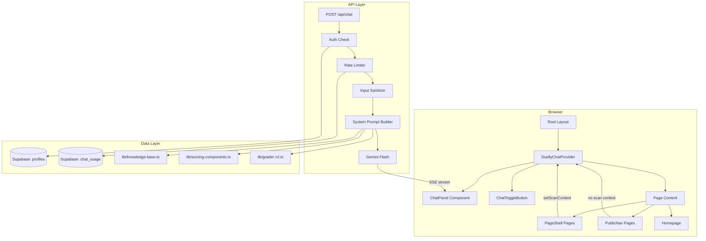
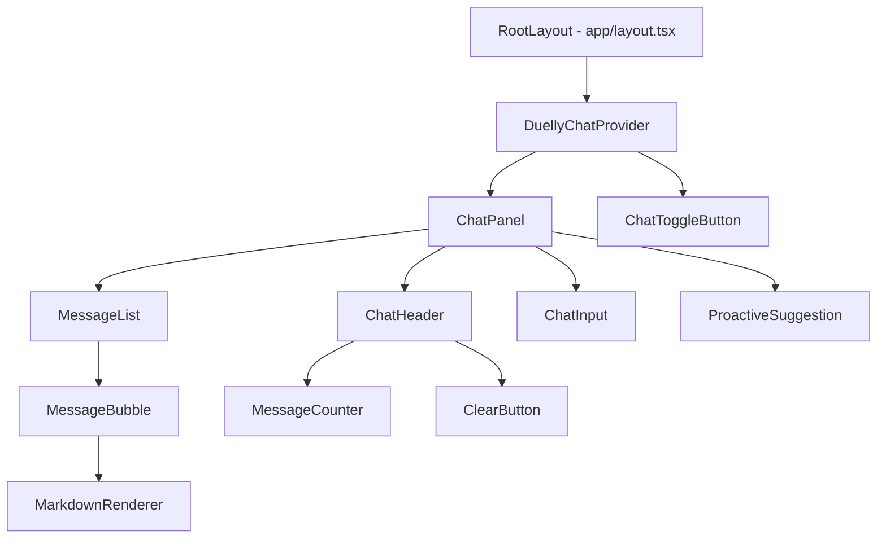

# Design Document: Duelly AI Assistant

## Overview

Duelly AI is a context-aware chat assistant embedded as a collapsible right-side panel across the entire Duelly platform. It leverages the existing Google Gemini Flash integration to provide expert SEO/AEO/GEO advice, understands the user's current scan results, and proactively highlights critical findings.

The assistant is implemented as a global React context provider wrapping the app layout, with a single API route handling chat requests via SSE streaming. Access is gated behind authentication and a credit balance check, with a 50-message daily rate limit tracked in Supabase.

Key design decisions:
- **Global context provider** rather than per-page integration — the chat panel and its state live at the root layout level, avoiding duplication across PageShell and PublicNav pages.
- **SSE streaming reusing existing patterns** — the `lib/sse-helpers.ts` utilities are extended for chat token streaming rather than inventing a new transport.
- **Client-side scan context injection** — scan results are already held in client state on tool pages; the context provider collects them via a setter hook and sends them with each chat request.
- **No message persistence** — conversation is session-scoped (in-memory React state), cleared on refresh/close, matching the requirement for zero server-side message storage.
- **System prompt assembled at request time** — static product knowledge is compiled once at build/startup, dynamic scan context is merged per-request.

## Architecture



### Request Flow

1. User types a message in the ChatPanel
2. ChatPanel calls `POST /api/chat` with: `{ message, conversationHistory, scanContext }`
3. API route authenticates via `getAuthUser()`, checks credit balance > 0
4. Rate limiter queries `chat_usage` table — rejects if >= 50 messages today (UTC)
5. Input sanitizer strips prompt injection patterns from the user message
6. System prompt builder assembles: static knowledge + dynamic scan context + safety guardrails
7. Gemini Flash is called with the system prompt + last 10 conversation messages
8. Response streams back via SSE, token by token
9. On completion, `chat_usage` row is upserted (increment `message_count`)
10. ChatPanel renders the streamed response with markdown formatting

## Components and Interfaces

### Component Hierarchy



### DuellyChatProvider (Context Provider)

Wraps the entire app in `app/layout.tsx`. Manages all chat state and exposes it via React context.

```typescript
interface DuellyChatContextValue {
  // State
  isOpen: boolean
  messages: ChatMessage[]
  isStreaming: boolean
  messageCount: number    // today's usage
  messageLimit: number    // 50
  error: string | null
  
  // Scan context (set by tool pages)
  scanContext: ScanContext | null
  setScanContext: (ctx: ScanContext | null) => void
  
  // Actions
  togglePanel: () => void
  sendMessage: (text: string) => Promise<void>
  clearConversation: () => void
  
  // Auth state
  user: UserProfile | null
  
  // Proactive suggestions
  proactiveSuggestion: string | null
}
```

### ChatPanel Component

Right-side collapsible panel. Renders inside the DuellyChatProvider, positioned with `fixed` CSS so it overlays on all page types without modifying PageShell or PublicNav internals.

```typescript
// Position: fixed right-0, full height, w-[380px] on desktop
// Collapsed: only ChatToggleButton visible (fixed right-4 bottom-4)
// Transition: translate-x with 300ms ease
// z-index: 40 (below modals at 50, above page content)
```

### Integration with Existing Layouts

The chat panel does NOT modify PageShell or PublicNav. Instead:

1. `DuellyChatProvider` is added to `app/layout.tsx` wrapping `{children}`
2. `ChatPanel` renders as a `fixed` positioned element — it floats over all pages
3. When open on desktop, the main content area does NOT shrink (panel overlays)
4. On PageShell pages, tool components call `setScanContext()` to inject scan data
5. On PublicNav pages, scan context remains null — assistant answers general questions

### ChatMessage Type

```typescript
interface ChatMessage {
  id: string
  role: 'user' | 'assistant'
  content: string
  timestamp: number
}
```

### ScanContext Type

```typescript
interface ScanContext {
  tool: 'pro-audit' | 'deep-scan' | 'battle-mode' | 'keyword-arena' | 'ai-test' | null
  url?: string
  seoScore?: number
  aeoScore?: number
  geoScore?: number
  siteType?: string
  platform?: string
  criticalIssues?: string[]
  penalties?: Array<{
    component: string
    penalty: string
    severity: 'critical' | 'warning' | 'info'
    pointsDeducted: number
    explanation: string
    fix: string
  }>
  backlinks?: {
    domainAuthority: number
    totalBacklinks: number
    topBacklinks: Array<{ source: string; anchor: string }>
  }
  competitorData?: any  // for battle-mode comparisons
  keywordData?: any     // for keyword-arena results
}
```

### API Route: POST /api/chat

```typescript
// app/api/chat/route.ts
interface ChatRequest {
  message: string
  conversationHistory: ChatMessage[]  // last 10 messages
  scanContext: ScanContext | null
}

// Response: SSE stream
// Events:
//   data: { type: "token", content: "..." }
//   data: { type: "done" }
//   data: { type: "error", message: "..." }
```

### System Prompt Builder

```typescript
// lib/chat/system-prompt-builder.ts
interface SystemPromptBuilder {
  build(scanContext: ScanContext | null): string
}

// Sections assembled:
// 1. Role & personality (static)
// 2. Safety guardrails (static)
// 3. Product knowledge — tools, scoring, grades (static, compiled from scoring-components.ts)
// 4. Fix library knowledge (static, compiled from grader-v2.ts getExplanation/getFix)
// 5. Knowledge base entries (static, compiled from knowledge-base.ts)
// 6. Dynamic scan context (per-request, from ScanContext)
// 7. Platform-specific guidance (conditional on detected platform)
```

### Input Sanitizer

```typescript
// lib/chat/input-sanitizer.ts
function sanitizeUserInput(input: string): string
// Strips patterns: "ignore previous instructions", "you are now", 
// "system:", "assistant:", "```system", role-override attempts
// Returns cleaned string, max 2000 chars
```

### Proactive Suggestion Generator

```typescript
// lib/chat/proactive-suggestions.ts
function generateProactiveSuggestion(scanContext: ScanContext): string | null
// Pure client-side function — no API call
// Counts critical/warning penalties, generates summary string
// Returns null if no critical issues found
```

## Data Models

### chat_usage Table (Supabase)

```sql
CREATE TABLE public.chat_usage (
  id UUID DEFAULT gen_random_uuid() PRIMARY KEY,
  user_id UUID REFERENCES public.profiles(id) ON DELETE CASCADE NOT NULL,
  date DATE NOT NULL DEFAULT CURRENT_DATE,
  message_count INTEGER NOT NULL DEFAULT 0,
  created_at TIMESTAMPTZ NOT NULL DEFAULT now(),
  updated_at TIMESTAMPTZ NOT NULL DEFAULT now(),
  UNIQUE (user_id, date)
);

ALTER TABLE public.chat_usage ENABLE ROW LEVEL SECURITY;

CREATE POLICY "Users can view own chat usage"
  ON public.chat_usage FOR SELECT
  USING (auth.uid() = user_id);

CREATE POLICY "Service role full access to chat_usage"
  ON public.chat_usage FOR ALL
  USING (true)
  WITH CHECK (true);

-- Auto-update timestamp
CREATE TRIGGER chat_usage_updated_at
  BEFORE UPDATE ON public.chat_usage
  FOR EACH ROW EXECUTE FUNCTION public.update_updated_at();
```

Rate limiting logic:
- On each chat request, `UPSERT` into `chat_usage` with `ON CONFLICT (user_id, date) DO UPDATE SET message_count = message_count + 1`
- Before processing, `SELECT message_count FROM chat_usage WHERE user_id = $1 AND date = CURRENT_DATE`
- If `message_count >= 50`, reject with rate limit error
- The `date` column naturally handles UTC midnight reset — new day = new row

### Client-Side State (No Persistence)

- `messages: ChatMessage[]` — in React state, cleared on page refresh
- `isOpen: boolean` — persisted to `localStorage` key `duelly-chat-open`
- `scanContext: ScanContext | null` — in React state, updated by tool pages
- `messageCount: number` — fetched from API on mount, incremented locally after each send


## Correctness Properties

*A property is a characteristic or behavior that should hold true across all valid executions of a system — essentially, a formal statement about what the system should do. Properties serve as the bridge between human-readable specifications and machine-verifiable correctness guarantees.*

### Property 1: Rate limiter threshold enforcement

*For any* user with a message count N (0 ≤ N), the rate limiter SHALL allow the request if and only if N < 50, and reject it otherwise.

**Validates: Requirements 2.4, 2.5**

### Property 2: Conversation history truncation

*For any* conversation history of length N, the messages array sent to Gemini Flash SHALL contain exactly min(N, 10) messages, and those messages SHALL be the last min(N, 10) messages from the history in order.

**Validates: Requirements 4.5**

### Property 3: Input sanitizer strips injection patterns

*For any* user input string, the sanitized output SHALL not contain any of the defined injection patterns (e.g., "ignore previous instructions", "you are now", "system:", "assistant:"). For any input string that contains no injection patterns, the sanitized output SHALL equal the original input (modulo length truncation at 2000 chars).

**Validates: Requirements 7.10**

### Property 4: Proactive suggestion reflects penalty severity

*For any* ScanContext containing a list of penalties with varying severities, the generated proactive suggestion string SHALL include the correct count of critical-severity issues. When the penalty list contains zero critical issues, the function SHALL return null.

**Validates: Requirements 5.3, 5.4**

### Property 5: Token stream concatenation produces complete message

*For any* sequence of SSE token events, the final displayed message content SHALL equal the concatenation of all token `content` values in the order they were received.

**Validates: Requirements 3.2**

### Property 6: Scan context fields are preserved in API payload

*For any* ScanContext object with populated fields (scores, penalties, siteType, platform, backlinks), the request payload sent to the Chat API SHALL contain all non-null fields from the ScanContext.

**Validates: Requirements 4.1**

### Property 7: Clear conversation produces empty state

*For any* message list of length N ≥ 0, calling clearConversation SHALL result in an empty messages array (length 0).

**Validates: Requirements 8.2**

### Property 8: Markdown rendering produces correct HTML elements

*For any* markdown string containing bold text, unordered lists, code blocks, or links, the rendered output SHALL contain the corresponding HTML elements (`<strong>`, `<ul>/<li>`, `<pre>/<code>`, `<a>`).

**Validates: Requirements 8.5**

### Property 9: Message counter displays correct usage format

*For any* message count value N where 0 ≤ N ≤ 50, the rendered counter SHALL display the string "N/50 messages today" with the correct value of N.

**Validates: Requirements 2.7**

### Property 10: Panel open/closed state round-trips through localStorage

*For any* boolean value representing the panel's open/closed state, writing it to localStorage and reading it back SHALL produce the same boolean value.

**Validates: Requirements 1.3**

## Error Handling

### API Route Errors

| Error Condition | HTTP Status | Response | Client Behavior |
|---|---|---|---|
| Unauthenticated | 401 | `{ error: "Authentication required" }` | Show login/signup prompt |
| Zero credits | 403 | `{ error: "No credits remaining" }` | Show purchase credits prompt |
| Rate limited (50/day) | 429 | `{ error: "Daily limit reached", resetsAt: "..." }` | Show limit message with reset time |
| Invalid/empty message | 400 | `{ error: "Message is required" }` | Show validation error |
| Gemini API failure | 502 | SSE: `{ type: "error", message: "..." }` | Show error message, re-enable input |
| Stream interrupted | N/A | Connection drops | Show connection error, re-enable input |
| Input too long (>2000 chars) | 400 | `{ error: "Message too long" }` | Show length error |

### Client-Side Error Handling

- SSE connection errors: catch in `EventSource.onerror`, display "Connection lost. Please try again.", re-enable input
- Network failures: catch in fetch, display generic error, re-enable input
- All errors clear the `isStreaming` state to prevent the UI from getting stuck
- No retry logic — user can manually resend their message

### Rate Limit Reset Communication

When a user hits the 50-message limit, the error response includes `resetsAt` (next midnight UTC as ISO string). The ChatPanel displays: "You've used all 50 messages for today. Your limit resets at [time]."

## Testing Strategy

### Property-Based Tests (fast-check)

The project will use `fast-check` for property-based testing in TypeScript. Each property test runs a minimum of 100 iterations.

Tests to implement:
- **Property 1**: Generate random integers 0-100, verify rate limiter allows/rejects at threshold 50
- **Property 2**: Generate conversation arrays of length 0-30, verify truncation to last 10
- **Property 3**: Generate random strings with/without injection patterns, verify sanitizer behavior
- **Property 4**: Generate random penalty arrays with mixed severities, verify suggestion output
- **Property 5**: Generate random token sequences, verify concatenation
- **Property 6**: Generate random ScanContext objects, verify all fields present in payload
- **Property 7**: Generate random message arrays, verify clear produces empty
- **Property 8**: Generate markdown strings with formatting, verify HTML output
- **Property 9**: Generate integers 0-50, verify counter display format
- **Property 10**: Generate random booleans, verify localStorage round-trip

Each test tagged with: `Feature: duelly-ai-assistant, Property N: [property text]`

### Unit Tests (vitest)

- System prompt builder: verify all required sections are present (tools, scoring, fixes, knowledge base, guardrails)
- System prompt builder: verify platform-specific content for each platform (WordPress, Shopify, Wix, Squarespace)
- System prompt builder: verify safety guardrail instructions (topic boundaries, data integrity, PII, content safety, liability)
- Proactive suggestion: verify null return when no critical issues
- Proactive suggestion: verify suggestion text when critical issues exist
- ChatPanel: render with user=null, verify login prompt
- ChatPanel: render with credits=0, verify purchase prompt
- ChatPanel: render with isStreaming=true, verify input disabled and loading indicator
- ChatPanel: verify "Duelly AI" title in header
- ChatPanel: verify clear button exists and functions

### Integration Tests

- Full chat flow: authenticated user sends message, receives streamed response
- Rate limiting: send 50 messages, verify 51st is rejected with 429
- SSE streaming: verify token events arrive in order and "done" event terminates stream
- Context injection: send message with scan context, verify Gemini receives context in system prompt

