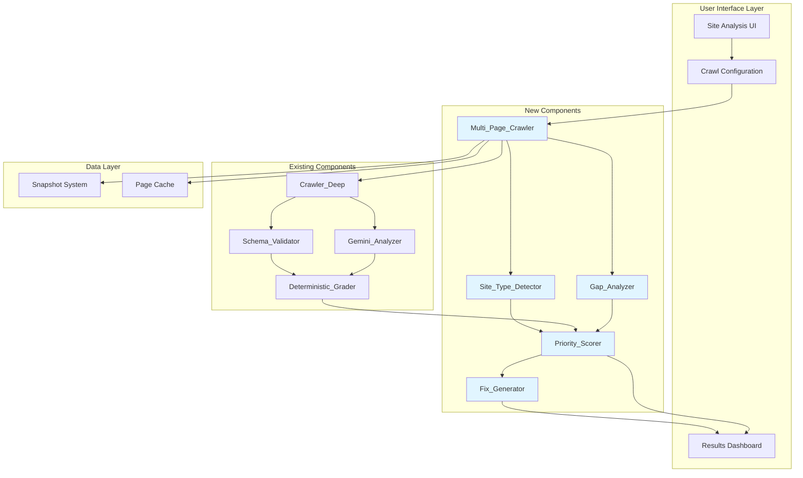

# Design Document: Intelligent Context-Aware Auditing

## Overview

The Intelligent Context-Aware Auditing system transforms the existing single-page SEO/AEO/GEO analyzer into a comprehensive multi-page site auditing platform. This enhancement adds five major capabilities:

1. **Site Type Detection**: Automatically classifies websites (e-commerce, local business, SaaS, etc.) to provide context-aware recommendations
2. **Multi-Page Crawling**: Discovers and analyzes 10-50 pages per site to identify site-wide patterns and issues
3. **Actionable Fix Generation**: Produces implementation-ready code snippets and step-by-step instructions for every recommendation
4. **Competitor Gap Analysis**: Compares analyzed sites against competitors to identify strategic opportunities
5. **Priority Scoring**: Calculates ROI-based rankings to help users focus on high-impact improvements

The system maintains backward compatibility with single-page analysis while seamlessly integrating with existing components: `Gemini_Analyzer` (AI analysis), `Deterministic_Grader` (scoring), and `Schema_Validator` (structured data validation).

### Design Goals

- Maintain existing scoring accuracy while adding context-aware adjustments
- Complete multi-page analysis within performance budgets (60s for 10 pages, 180s for 50 pages)
- Generate production-ready code that users can copy-paste directly
- Provide clear, actionable priorities based on effort vs impact
- Preserve deterministic scoring reliability while leveraging AI for qualitative insights


## Architecture

### High-Level System Diagram



### Data Flow

1. **Input Phase**: User provides URL and configuration (crawl depth: 10/20/50 pages, optional competitor URLs)
2. **Discovery Phase**: Multi_Page_Crawler starts from homepage, extracts internal links, builds crawl queue
3. **Crawling Phase**: Parallel processing (batches of 3) extracts PageScan data for each URL
4. **Detection Phase**: Site_Type_Detector analyzes homepage + aggregate data to classify site type
5. **Analysis Phase**: 
   - Schema_Validator performs deterministic validation
   - Gemini_Analyzer receives site type context and performs qualitative analysis
   - Deterministic_Grader calculates scores with site-type-specific weights
6. **Comparison Phase** (if competitors provided): Gap_Analyzer identifies schema, content, and structural differences
7. **Prioritization Phase**: Priority_Scorer calculates ROI, effort, and impact scores for all recommendations
8. **Generation Phase**: Fix_Generator produces platform-specific code and instructions
9. **Output Phase**: Results dashboard displays site type badge, priority matrix, page-by-page comparison, and actionable fixes


### Integration Points with Existing Codebase

**lib/crawler-deep.ts**
- Reuse `PageScan` interface and `performDeepScan()` function
- Extend with additional fields: `orphanScore`, `duplicateContentHash`, `platformDetection`
- Multi_Page_Crawler wraps existing crawler with link graph analysis

**lib/schema-validator.ts**
- Reuse `validateSchemas()` for deterministic validation
- Extend with site-type-aware validation rules
- Add `validateSchemaForSiteType()` to check context-appropriate schema

**lib/grader.ts**
- Reuse `calculateDeterministicScores()` function
- Add site-type-specific penalty weights via configuration
- Extend penalty ledger with multi-page issue types

**lib/gemini-sitewide.ts**
- Extend `analyzeSitewideIntelligence()` to accept site type context
- Add competitor comparison prompts
- Enhance recommendations with fix generation instructions

**app/site-analysis/page.tsx**
- Add crawl configuration UI (page count selector, competitor URL inputs)
- Integrate new result components (site type badge, priority matrix, page table)
- Maintain single-page mode as default with opt-in multi-page analysis


## Components and Interfaces

### 1. Site_Type_Detector

**Purpose**: Classify websites into business categories to enable context-aware recommendations.

**Algorithm**:
```typescript
function detectSiteType(homePage: PageScan, allPages: PageScan[]): SiteTypeResult {
  const signals: ClassificationSignal[] = [];
  const scores = new Map<SiteType, number>();
  
  // Signal 1: Schema Type Analysis (40% weight)
  const schemaTypes = new Set(homePage.schemas.map(s => s['@type']).flat());
  if (schemaTypes.has('LocalBusiness')) scores.set('local-business', 40);
  if (schemaTypes.has('Restaurant')) scores.set('restaurant', 40);
  if (schemaTypes.has('Product') || schemaTypes.has('Offer')) scores.set('e-commerce', 40);
  if (schemaTypes.has('SoftwareApplication')) scores.set('saas', 40);
  if (schemaTypes.has('Article') || schemaTypes.has('BlogPosting')) scores.set('blog', 40);
  
  // Signal 2: Content Pattern Matching (30% weight)
  const contentPatterns = {
    'e-commerce': /add to cart|shopping cart|checkout|buy now|price/i,
    'local-business': /hours|location|directions|call us|visit us/i,
    'saas': /pricing|plans|free trial|demo|sign up/i,
    'blog': /posted on|by author|read more|comments|categories/i,
    'restaurant': /menu|reservations|order online|delivery/i,
    'contractor': /free estimate|licensed|insured|years of experience/i
  };
  
  Object.entries(contentPatterns).forEach(([type, pattern]) => {
    if (pattern.test(homePage.thinnedText)) {
      scores.set(type as SiteType, (scores.get(type as SiteType) || 0) + 30);
    }
  });
  
  // Signal 3: Structural Analysis (20% weight)
  const hasProductPages = allPages.some(p => /product|item|shop/i.test(p.url));
  const hasBlogPages = allPages.some(p => /blog|article|post/i.test(p.url));
  const hasLocationPages = allPages.some(p => /location|contact|about/i.test(p.url));
  
  if (hasProductPages) scores.set('e-commerce', (scores.get('e-commerce') || 0) + 20);
  if (hasBlogPages) scores.set('blog', (scores.get('blog') || 0) + 20);
  if (hasLocationPages) scores.set('local-business', (scores.get('local-business') || 0) + 20);
  
  // Signal 4: URL Structure (10% weight)
  if (/\/products?\/|\/shop\//i.test(homePage.url)) {
    scores.set('e-commerce', (scores.get('e-commerce') || 0) + 10);
  }
  
  // Select primary type (highest score)
  const sortedTypes = Array.from(scores.entries()).sort((a, b) => b[1] - a[1]);
  const primaryType = sortedTypes[0]?.[0] || 'general';
  const confidence = sortedTypes[0]?.[1] || 0;
  
  // Identify secondary types (score >= 50)
  const secondaryTypes = sortedTypes.slice(1).filter(([_, score]) => score >= 50).map(([type]) => type);
  
  return {
    primaryType,
    secondaryTypes,
    confidence,
    signals: Array.from(scores.entries()).map(([type, score]) => ({
      type,
      score,
      evidence: `Detected via schema, content, and structure analysis`
    }))
  };
}
```

**Confidence Scoring**:
- 85-100: High confidence (display badge without prompt)
- 70-84: Medium confidence (display badge with "Confirm?" option)
- <70: Low confidence (prompt user to manually select)

**Interface**:
```typescript
interface SiteTypeResult {
  primaryType: SiteType;
  secondaryTypes: SiteType[];
  confidence: number; // 0-100
  signals: ClassificationSignal[];
}

type SiteType = 
  | 'e-commerce'
  | 'local-business'
  | 'blog'
  | 'saas'
  | 'portfolio'
  | 'restaurant'
  | 'contractor'
  | 'professional-services'
  | 'news-media'
  | 'educational'
  | 'general';

interface ClassificationSignal {
  type: SiteType;
  score: number;
  evidence: string;
}
```


### 2. Multi_Page_Crawler

**Purpose**: Discover and analyze multiple pages across a domain with parallel processing and error handling.

**Architecture**:
- Wraps existing `performDeepScan()` from lib/crawler-deep.ts
- Adds link graph analysis, orphan detection, and duplicate content identification
- Implements intelligent page prioritization based on link depth and importance

**Link Discovery Algorithm**:
```typescript
function prioritizePages(links: string[], homepage: PageScan): string[] {
  const scored = links.map(url => {
    let score = 0;
    
    // Priority 1: Depth (closer to homepage = higher priority)
    const depth = calculateDepth(url, homepage.url);
    score += (5 - Math.min(depth, 5)) * 20; // Max 100 points
    
    // Priority 2: URL patterns (important pages)
    if (/\/(about|services|products|contact)/i.test(url)) score += 50;
    if (/\/(blog|news|articles)/i.test(url)) score += 30;
    if (/\/(privacy|terms|legal)/i.test(url)) score -= 20; // Lower priority
    
    // Priority 3: URL length (shorter = more important)
    const segments = url.split('/').filter(Boolean).length;
    score += Math.max(0, 50 - segments * 10);
    
    return { url, score };
  });
  
  return scored.sort((a, b) => b.score - a.score).map(s => s.url);
}
```

**Orphan Detection**:
```typescript
function detectOrphans(pages: PageScan[]): OrphanAnalysis {
  const inboundLinks = new Map<string, number>();
  
  // Count inbound links for each page
  pages.forEach(page => {
    page.outboundLinks.forEach(link => {
      inboundLinks.set(link, (inboundLinks.get(link) || 0) + 1);
    });
  });
  
  // Identify orphans (0-1 inbound links, excluding homepage)
  const orphans = pages
    .filter(p => !isHomepage(p.url))
    .filter(p => (inboundLinks.get(p.url) || 0) <= 1)
    .map(p => ({
      url: p.url,
      inboundCount: inboundLinks.get(p.url) || 0,
      severity: inboundLinks.get(p.url) === 0 ? 'critical' : 'medium'
    }));
  
  return { orphans, linkGraph: inboundLinks };
}
```

**Duplicate Content Detection**:
```typescript
function detectDuplicates(pages: PageScan[]): DuplicateGroup[] {
  const hashes = new Map<string, PageScan[]>();
  
  pages.forEach(page => {
    // Simple hash: first 500 chars of thinned text
    const hash = simpleHash(page.thinnedText.substring(0, 500));
    if (!hashes.has(hash)) hashes.set(hash, []);
    hashes.get(hash)!.push(page);
  });
  
  // Return groups with 2+ pages
  return Array.from(hashes.values())
    .filter(group => group.length > 1)
    .map(group => ({
      pages: group.map(p => p.url),
      similarity: 'high', // Could use Levenshtein distance for precision
      recommendation: 'Consolidate or differentiate content'
    }));
}
```

**Interface**:
```typescript
interface MultiPageScanResult {
  domain: string;
  pagesCrawled: number;
  pages: PageScan[];
  siteWideIssues: SiteWideIssue[];
  internalLinkGraph: Map<string, number>;
  orphanPages: OrphanPage[];
  duplicateGroups: DuplicateGroup[];
  crawlMetadata: {
    startTime: Date;
    endTime: Date;
    durationMs: number;
    failedPages: FailedPage[];
  };
}

interface SiteWideIssue {
  type: 'missing-h1' | 'thin-content' | 'missing-meta' | 'poor-alt-coverage';
  affectedPages: string[];
  count: number;
  severity: 'critical' | 'high' | 'medium';
}

interface OrphanPage {
  url: string;
  inboundCount: number;
  severity: 'critical' | 'medium';
}

interface DuplicateGroup {
  pages: string[];
  similarity: 'high' | 'medium';
  recommendation: string;
}
```


### 3. Fix_Generator

**Purpose**: Generate implementation-ready code snippets and step-by-step instructions for every recommendation.

**Platform Detection**:
```typescript
function detectPlatform(page: PageScan): Platform {
  const html = page.thinnedText.toLowerCase();
  const url = page.url.toLowerCase();
  
  // WordPress detection
  if (html.includes('wp-content') || html.includes('wordpress')) {
    return { type: 'wordpress', confidence: 95 };
  }
  
  // Shopify detection
  if (html.includes('shopify') || url.includes('myshopify.com')) {
    return { type: 'shopify', confidence: 95 };
  }
  
  // Next.js detection
  if (html.includes('__next') || html.includes('_next/static')) {
    return { type: 'nextjs', confidence: 90 };
  }
  
  // React detection
  if (html.includes('react') && !html.includes('__next')) {
    return { type: 'react', confidence: 80 };
  }
  
  // Default to custom HTML
  return { type: 'custom-html', confidence: 60 };
}
```

**Code Generation Templates**:
```typescript
function generateSchemaCode(
  schemaType: string,
  siteData: any,
  platform: Platform
): FixInstruction {
  const schema = buildSchemaObject(schemaType, siteData);
  const jsonLd = JSON.stringify(schema, null, 2);
  
  const instructions: InstructionStep[] = [];
  
  if (platform.type === 'wordpress') {
    instructions.push({
      step: 1,
      title: 'Install Yoast SEO or Rank Math plugin',
      description: 'Navigate to Plugins > Add New, search for "Yoast SEO"'
    });
    instructions.push({
      step: 2,
      title: 'Add schema in plugin settings',
      description: 'Go to SEO > Schema > Add Schema, paste the JSON-LD code below'
    });
  } else if (platform.type === 'nextjs') {
    instructions.push({
      step: 1,
      title: 'Add to layout.tsx or page.tsx',
      description: 'Insert the script tag in the <head> section or return it from your component'
    });
    instructions.push({
      step: 2,
      title: 'Verify in browser',
      description: 'View page source and confirm the JSON-LD appears in <head>'
    });
  } else {
    instructions.push({
      step: 1,
      title: 'Add to HTML <head> section',
      description: 'Paste the script tag below into your page <head>, before </head>'
    });
  }
  
  instructions.push({
    step: instructions.length + 1,
    title: 'Validate with Google Rich Results Test',
    description: 'Visit https://search.google.com/test/rich-results and test your URL',
    validationUrl: 'https://search.google.com/test/rich-results'
  });
  
  return {
    title: `Add ${schemaType} Schema`,
    steps: instructions,
    code: platform.type === 'nextjs' 
      ? generateNextJsSchemaComponent(schema)
      : generateHtmlSchemaTag(jsonLd),
    platform: platform.type,
    estimatedTime: '5-10 minutes',
    difficulty: 'easy',
    impact: 'high'
  };
}

function generateHtmlSchemaTag(jsonLd: string): string {
  return `<script type="application/ld+json">
${jsonLd}
</script>`;
}

function generateNextJsSchemaComponent(schema: any): string {
  return `// Add to your page.tsx or layout.tsx
export default function Page() {
  return (
    <>
      <script
        type="application/ld+json"
        dangerouslySetInnerHTML={{
          __html: JSON.stringify(${JSON.stringify(schema, null, 2)})
        }}
      />
      {/* Your page content */}
    </>
  );
}`;
}
```

**Pre-populated Schema Builder**:
```typescript
function buildSchemaObject(type: string, siteData: any): any {
  const base = {
    '@context': 'https://schema.org',
    '@type': type
  };
  
  if (type === 'LocalBusiness') {
    return {
      ...base,
      name: siteData.businessName || '[Your Business Name]',
      address: {
        '@type': 'PostalAddress',
        streetAddress: siteData.address?.street || '[Street Address]',
        addressLocality: siteData.address?.city || '[City]',
        addressRegion: siteData.address?.region || '[State/Province]',
        postalCode: siteData.address?.postal || '[Postal Code]',
        addressCountry: siteData.address?.country || '[Country Code]'
      },
      telephone: siteData.phone || '[+1-XXX-XXX-XXXX]',
      url: siteData.url,
      openingHours: 'Mo-Fr 09:00-17:00',
      priceRange: '$$'
    };
  }
  
  // Additional schema types...
  return base;
}
```

**Interface**:
```typescript
interface FixInstruction {
  title: string;
  steps: InstructionStep[];
  code?: string;
  platform: PlatformType;
  estimatedTime: string;
  difficulty: 'easy' | 'moderate' | 'difficult';
  impact: 'high' | 'medium' | 'low';
  beforeAfter?: {
    before: string;
    after: string;
  };
  validationLinks?: string[];
}

interface InstructionStep {
  step: number;
  title: string;
  description: string;
  code?: string;
  validationUrl?: string;
}

type PlatformType = 'wordpress' | 'shopify' | 'nextjs' | 'react' | 'custom-html';
```


### 4. Gap_Analyzer

**Purpose**: Compare analyzed site against competitors to identify strategic opportunities.

**Comparison Algorithm**:
```typescript
async function analyzeCompetitorGaps(
  targetSite: MultiPageScanResult,
  competitors: MultiPageScanResult[]
): Promise<GapAnalysis> {
  const gaps: CompetitorGap[] = [];
  
  // 1. Schema Gap Analysis
  const targetSchemas = new Set(
    targetSite.pages.flatMap(p => p.schemaTypes)
  );
  
  competitors.forEach(comp => {
    const compSchemas = new Set(
      comp.pages.flatMap(p => p.schemaTypes)
    );
    
    compSchemas.forEach(schemaType => {
      if (!targetSchemas.has(schemaType)) {
        const examples = comp.pages
          .filter(p => p.schemaTypes.includes(schemaType))
          .slice(0, 2)
          .map(p => ({ url: p.url, schema: p.schemas.find(s => s['@type'] === schemaType) }));
        
        gaps.push({
          type: 'schema',
          category: schemaType,
          description: `Competitor has ${schemaType} schema, you don't`,
          impact: calculateSchemaImpact(schemaType),
          examples: examples.map(e => e.url),
          recommendation: `Add ${schemaType} schema to relevant pages`
        });
      }
    });
  });
  
  // 2. Content Gap Analysis
  const targetTopics = extractTopics(targetSite.pages);
  const competitorTopics = competitors.flatMap(c => extractTopics(c.pages));
  
  const missingTopics = competitorTopics.filter(topic => 
    !targetTopics.some(t => similarity(t, topic) > 0.7)
  );
  
  missingTopics.slice(0, 5).forEach(topic => {
    gaps.push({
      type: 'content',
      category: topic.category,
      description: `Competitors cover "${topic.title}", you don't`,
      impact: 'medium',
      examples: topic.urls,
      recommendation: `Create content about ${topic.title}`
    });
  });
  
  // 3. Structural Gap Analysis
  const targetStructure = analyzeStructure(targetSite);
  const competitorStructures = competitors.map(analyzeStructure);
  
  const commonFeatures = findCommonFeatures(competitorStructures);
  commonFeatures.forEach(feature => {
    if (!targetStructure.has(feature.type)) {
      gaps.push({
        type: 'structural',
        category: feature.type,
        description: `${feature.count}/${competitors.length} competitors have ${feature.name}`,
        impact: feature.count === competitors.length ? 'high' : 'medium',
        examples: feature.examples,
        recommendation: `Add ${feature.name} to your site`
      });
    }
  });
  
  // 4. Calculate Competitive Advantage Score
  const advantageScore = calculateAdvantageScore(targetSite, competitors, gaps);
  
  return {
    gaps,
    advantageScore,
    strengths: identifyStrengths(targetSite, competitors),
    quickWins: gaps.filter(g => g.impact === 'high' && isQuickWin(g))
  };
}

function calculateSchemaImpact(schemaType: string): 'high' | 'medium' | 'low' {
  const highImpact = ['Review', 'Product', 'FAQPage', 'HowTo', 'LocalBusiness'];
  const mediumImpact = ['BreadcrumbList', 'Organization', 'Article'];
  
  if (highImpact.includes(schemaType)) return 'high';
  if (mediumImpact.includes(schemaType)) return 'medium';
  return 'low';
}

function extractTopics(pages: PageScan[]): Topic[] {
  // Extract topics from titles, H1s, and content
  return pages.map(page => ({
    title: page.title,
    category: categorizeContent(page.thinnedText),
    urls: [page.url],
    wordCount: page.wordCount
  }));
}

function analyzeStructure(site: MultiPageScanResult): Set<string> {
  const features = new Set<string>();
  
  site.pages.forEach(page => {
    if (/faq/i.test(page.url)) features.add('faq-page');
    if (/blog/i.test(page.url)) features.add('blog');
    if (/case-stud|portfolio/i.test(page.url)) features.add('case-studies');
    if (/testimonial|review/i.test(page.url)) features.add('testimonials');
    if (/resource|guide/i.test(page.url)) features.add('resource-library');
  });
  
  return features;
}
```

**Interface**:
```typescript
interface GapAnalysis {
  gaps: CompetitorGap[];
  advantageScore: number; // 0-100
  strengths: Strength[];
  quickWins: CompetitorGap[];
}

interface CompetitorGap {
  type: 'schema' | 'content' | 'structural' | 'keyword';
  category: string;
  description: string;
  impact: 'high' | 'medium' | 'low';
  examples: string[]; // URLs or code examples
  recommendation: string;
}

interface Strength {
  category: string;
  description: string;
  advantage: string; // What you do better than competitors
}
```


### 5. Priority_Scorer

**Purpose**: Calculate ROI-based rankings to help users focus on high-impact improvements.

**ROI Calculation Formula**:
```typescript
function calculatePriorityScore(
  recommendation: Recommendation,
  siteType: SiteType,
  currentScores: Scores
): PriorityRecommendation {
  // 1. Calculate Impact Score (0-100)
  const impactScore = calculateImpact(recommendation, siteType, currentScores);
  
  // 2. Calculate Effort Score (1-3)
  const effortScore = calculateEffort(recommendation);
  
  // 3. Calculate ROI Score (Impact / Effort)
  const roiScore = impactScore / effortScore;
  
  // 4. Estimate score improvements
  const estimatedImprovement = estimateScoreGain(recommendation, currentScores);
  
  return {
    recommendation,
    roiScore,
    effortScore,
    impactScore,
    estimatedImprovement,
    category: categorizeByROI(roiScore, effortScore),
    reasoning: explainPriority(recommendation, impactScore, effortScore)
  };
}

function calculateImpact(
  rec: Recommendation,
  siteType: SiteType,
  scores: Scores
): number {
  let impact = rec.baseImpact || 50;
  
  // Site-type-specific adjustments
  const siteTypeMultipliers: Record<string, Record<string, number>> = {
    'local-business': {
      'LocalBusiness schema': 1.5,
      'Review schema': 1.4,
      'Opening hours': 1.3,
      'NAP consistency': 1.3
    },
    'e-commerce': {
      'Product schema': 1.5,
      'Review schema': 1.4,
      'Breadcrumb schema': 1.2,
      'Image alt text': 1.3
    },
    'blog': {
      'Article schema': 1.4,
      'Author schema': 1.2,
      'FAQ schema': 1.3,
      'Internal linking': 1.3
    },
    'saas': {
      'SoftwareApplication schema': 1.5,
      'FAQ schema': 1.4,
      'HowTo schema': 1.3,
      'Pricing page': 1.2
    }
  };
  
  const multiplier = siteTypeMultipliers[siteType]?.[rec.type] || 1.0;
  impact *= multiplier;
  
  // Adjust based on current scores (bigger gaps = higher impact)
  if (rec.affectsScore === 'aeo' && scores.aeo < 70) impact *= 1.2;
  if (rec.affectsScore === 'seo' && scores.seo < 70) impact *= 1.2;
  if (rec.affectsScore === 'geo' && scores.geo < 70) impact *= 1.2;
  
  // Adjust based on affected page count
  if (rec.affectedPages > 10) impact *= 1.3;
  else if (rec.affectedPages > 5) impact *= 1.15;
  
  return Math.min(100, impact);
}

function calculateEffort(rec: Recommendation): 1 | 2 | 3 {
  // Effort scoring:
  // 1 = Easy (< 30 min, copy-paste code, no dev needed)
  // 2 = Moderate (30-120 min, some customization, basic dev skills)
  // 3 = Difficult (> 2 hours, significant dev work, testing required)
  
  const effortMap: Record<string, number> = {
    'Add schema markup': 1,
    'Fix meta descriptions': 1,
    'Add alt text': 1,
    'Add H1 tags': 1,
    'Fix title tags': 1,
    'Add FAQ schema': 2,
    'Improve internal linking': 2,
    'Add breadcrumbs': 2,
    'Create FAQ page': 2,
    'Expand thin content': 3,
    'Restructure site architecture': 3,
    'Implement dynamic schema': 3,
    'Build resource library': 3
  };
  
  return (effortMap[rec.type] || 2) as 1 | 2 | 3;
}

function categorizeByROI(roiScore: number, effort: number): string {
  if (roiScore > 50 && effort === 1) return 'Quick Win';
  if (roiScore > 40 && effort <= 2) return 'High Priority';
  if (roiScore > 30) return 'Medium Priority';
  if (effort === 3 && roiScore > 25) return 'Long-term Investment';
  return 'Low Priority';
}

function estimateScoreGain(rec: Recommendation, current: Scores): ScoreImprovement {
  // Estimate point gains based on recommendation type
  const gains: Record<string, Partial<Scores>> = {
    'Add LocalBusiness schema': { aeo: 15, geo: 5 },
    'Add Product schema': { aeo: 20, seo: 5 },
    'Fix meta descriptions': { seo: 10 },
    'Add FAQ schema': { aeo: 12, seo: 3 },
    'Improve internal linking': { seo: 8, aeo: 3 },
    'Add image alt text': { seo: 5, geo: 10 }
  };
  
  const gain = gains[rec.type] || { seo: 5, aeo: 5, geo: 5 };
  
  return {
    seo: Math.min(100 - current.seo, gain.seo || 0),
    aeo: Math.min(100 - current.aeo, gain.aeo || 0),
    geo: Math.min(100 - current.geo, gain.geo || 0)
  };
}
```

**Effort vs Impact Matrix**:
```
High Impact │ 3. Long-term    │ 1. Quick Wins
            │    Investments  │    (DO FIRST)
            │                 │
            ├─────────────────┼─────────────────
            │ 4. Low Priority │ 2. High Priority
Low Impact  │                 │
            └─────────────────┴─────────────────
              High Effort       Low Effort
```

**Interface**:
```typescript
interface PriorityRecommendation {
  recommendation: Recommendation;
  roiScore: number; // Impact / Effort
  effortScore: 1 | 2 | 3;
  impactScore: number; // 0-100
  estimatedImprovement: ScoreImprovement;
  category: 'Quick Win' | 'High Priority' | 'Medium Priority' | 'Long-term Investment' | 'Low Priority';
  reasoning: string;
  estimatedTime: string;
  affectedPages: number;
}

interface ScoreImprovement {
  seo: number;
  aeo: number;
  geo: number;
}

interface Recommendation {
  type: string;
  title: string;
  description: string;
  affectsScore: 'seo' | 'aeo' | 'geo' | 'all';
  affectedPages: number;
  baseImpact: number;
}
```


## Data Models

### Core Data Structures

```typescript
// Extended PageScan (builds on lib/crawler-deep.ts)
interface PageScan {
  // Existing fields from lib/crawler-deep.ts
  url: string;
  title: string;
  description: string;
  schemas: any[];
  schemaTypes: string[];
  thinnedText: string;
  status: 'success' | 'failed';
  wordCount: number;
  internalLinks: number;
  externalLinks: number;
  hasH1: boolean;
  isHttps: boolean;
  responseTimeMs: number;
  h2Count: number;
  h3Count: number;
  imgTotal: number;
  imgWithAlt: number;
  outboundLinks: string[];
  
  // New fields for enhanced analysis
  orphanScore?: number; // 0-100, lower = more orphaned
  duplicateContentHash?: string;
  platformDetection?: Platform;
  linkDepth?: number; // Distance from homepage
  schemaQuality?: SchemaValidationResult; // From schema-validator.ts
}

// Site Type Detection
interface SiteTypeResult {
  primaryType: SiteType;
  secondaryTypes: SiteType[];
  confidence: number;
  signals: ClassificationSignal[];
  recommendedSchemas: string[]; // Schema types appropriate for this site type
}

type SiteType = 
  | 'e-commerce'
  | 'local-business'
  | 'blog'
  | 'saas'
  | 'portfolio'
  | 'restaurant'
  | 'contractor'
  | 'professional-services'
  | 'news-media'
  | 'educational'
  | 'general';

interface ClassificationSignal {
  type: SiteType;
  score: number;
  evidence: string;
}

// Multi-Page Scan Result
interface MultiPageScanResult {
  domain: string;
  pagesCrawled: number;
  pages: PageScan[];
  siteType: SiteTypeResult;
  siteWideIssues: SiteWideIssue[];
  internalLinkGraph: Map<string, number>;
  orphanPages: OrphanPage[];
  duplicateGroups: DuplicateGroup[];
  aggregateScores: {
    seo: number;
    aeo: number;
    geo: number;
  };
  crawlMetadata: CrawlMetadata;
}

interface SiteWideIssue {
  type: 'missing-h1' | 'thin-content' | 'missing-meta' | 'poor-alt-coverage' | 'orphan-pages' | 'duplicate-content';
  affectedPages: string[];
  count: number;
  severity: 'critical' | 'high' | 'medium';
  description: string;
}

interface CrawlMetadata {
  startTime: Date;
  endTime: Date;
  durationMs: number;
  failedPages: FailedPage[];
  robotsTxtRespected: boolean;
  crawlDepthLimit: number;
}

interface FailedPage {
  url: string;
  error: string;
  statusCode?: number;
}

// Fix Instructions
interface FixInstruction {
  title: string;
  steps: InstructionStep[];
  code?: string;
  platform: PlatformType;
  estimatedTime: string;
  difficulty: 'easy' | 'moderate' | 'difficult';
  impact: 'high' | 'medium' | 'low';
  beforeAfter?: {
    before: string;
    after: string;
  };
  validationLinks?: ValidationLink[];
}

interface InstructionStep {
  step: number;
  title: string;
  description: string;
  code?: string;
  screenshot?: string;
  validationUrl?: string;
}

interface ValidationLink {
  tool: string;
  url: string;
  description: string;
}

type PlatformType = 'wordpress' | 'shopify' | 'nextjs' | 'react' | 'custom-html';

interface Platform {
  type: PlatformType;
  confidence: number;
  version?: string;
}

// Competitor Gap Analysis
interface GapAnalysis {
  gaps: CompetitorGap[];
  advantageScore: number; // 0-100
  strengths: Strength[];
  quickWins: CompetitorGap[];
  competitorCount: number;
}

interface CompetitorGap {
  type: 'schema' | 'content' | 'structural' | 'keyword';
  category: string;
  description: string;
  impact: 'high' | 'medium' | 'low';
  examples: string[];
  recommendation: string;
  estimatedTrafficGain?: string;
}

interface Strength {
  category: string;
  description: string;
  advantage: string;
  maintainStrategy: string;
}

// Priority Scoring
interface PriorityRecommendation {
  id: string;
  recommendation: Recommendation;
  roiScore: number;
  effortScore: 1 | 2 | 3;
  impactScore: number;
  estimatedImprovement: ScoreImprovement;
  category: 'Quick Win' | 'High Priority' | 'Medium Priority' | 'Long-term Investment' | 'Low Priority';
  reasoning: string;
  estimatedTime: string;
  affectedPages: number;
  fixInstructions: FixInstruction;
  completed?: boolean;
}

interface Recommendation {
  type: string;
  title: string;
  description: string;
  affectsScore: 'seo' | 'aeo' | 'geo' | 'all';
  affectedPages: number;
  baseImpact: number;
  source: 'deterministic' | 'gemini' | 'gap-analysis';
}

interface ScoreImprovement {
  seo: number;
  aeo: number;
  geo: number;
  total: number;
}

// Complete Audit Result
interface AuditResult {
  domain: string;
  timestamp: Date;
  scanResult: MultiPageScanResult;
  siteType: SiteTypeResult;
  gapAnalysis?: GapAnalysis;
  prioritizedRecommendations: PriorityRecommendation[];
  summary: AuditSummary;
}

interface AuditSummary {
  overallHealth: number; // 0-100
  criticalIssues: number;
  quickWins: number;
  estimatedTotalImpact: ScoreImprovement;
  topPriorities: PriorityRecommendation[]; // Top 3
}
```


## Correctness Properties

*A property is a characteristic or behavior that should hold true across all valid executions of a system—essentially, a formal statement about what the system should do. Properties serve as the bridge between human-readable specifications and machine-verifiable correctness guarantees.*

### Property Reflection

After analyzing all acceptance criteria, I identified several areas of redundancy:

- Multiple properties test "completeness" (non-empty fields) across different components - these can be consolidated into comprehensive data structure validation properties
- Several properties test score bounds (0-100, 1-3) - these can be combined into a single bounds validation property
- Multiple properties test error handling patterns (log and continue) - these can be unified into a general error resilience property
- UI rendering properties (8.1-8.12) are primarily examples rather than universal properties - they validate specific component behavior
- Performance requirements (9.1-9.4, 9.6, 9.8) are not suitable for property-based testing

The following properties represent the unique, testable behaviors after eliminating redundancy:


### Property 1: Site Type Classification Validity

*For any* site data (homepage content, schemas, page structure), the Site_Type_Detector should return a classification result where the primary type is one of the valid enum values (e-commerce, local-business, blog, saas, portfolio, restaurant, contractor, professional-services, news-media, educational, general), the confidence score is between 0-100, and all secondary types are also valid enum values.

**Validates: Requirements 1.1, 1.2, 1.8**

### Property 2: Site Type Influences Scoring

*For any* two identical page scans analyzed with different site types, the scoring weights and penalty calculations should differ, demonstrating that site type context affects the deterministic grading algorithm.

**Validates: Requirements 1.5, 5.11, 7.2**

### Property 3: Low Confidence Triggers Manual Selection

*For any* site type classification with confidence below 70, the system should flag the result as requiring manual user confirmation.

**Validates: Requirements 1.9**

### Property 4: Multi-Page Crawl Respects Configuration

*For any* valid crawl configuration (10, 20, or 50 pages), the crawler should return at most that many pages, with the actual count being less only if the site has fewer discoverable pages.

**Validates: Requirements 2.1**

### Property 5: Homepage is Always First

*For any* multi-page crawl result, the first page in the results should be the homepage (depth 0), and all internal links should be extracted from it.

**Validates: Requirements 2.2**

### Property 6: Page Scan Completeness

*For any* successfully crawled page, the PageScan object should contain all required fields: url, title, description, schemas, schemaTypes, wordCount, hasH1, internalLinks, externalLinks, imgTotal, imgWithAlt, isHttps, responseTimeMs, and outboundLinks.

**Validates: Requirements 2.4**

### Property 7: Error Resilience in Crawling

*For any* multi-page crawl where some pages fail to load, the result should include both successful PageScan objects and a list of failed pages with error details, and the crawl should complete rather than abort.

**Validates: Requirements 2.7, 10.1, 10.2**

### Property 8: Site-Wide Issue Aggregation Accuracy

*For any* set of crawled pages, the count of pages with each issue type (missing H1, thin content, missing meta description) should exactly match the number of pages that actually have that issue.

**Validates: Requirements 2.8, 2.9**

### Property 9: Orphan Detection Correctness

*For any* internal link graph, a page should be classified as orphaned if and only if it has 0-1 inbound links from other pages (excluding the homepage from orphan classification).

**Validates: Requirements 2.11**

### Property 10: Duplicate Content Detection

*For any* set of pages where two or more have identical content (same thinned text), the duplicate detection algorithm should group them together.

**Validates: Requirements 2.12**

### Property 11: Link Graph Accuracy

*For any* multi-page crawl result, the internal link graph should accurately represent the links between pages: for each page A linking to page B, the graph should show B has an inbound link from A.

**Validates: Requirements 2.13**

### Property 12: Fix Instructions Completeness

*For any* recommendation, the Fix_Generator should produce a FixInstruction object with non-empty title, at least one step, platform type, estimated time, difficulty level, and impact level.

**Validates: Requirements 3.1, 3.2, 3.9**

### Property 13: Schema Code Generation Validity

*For any* schema recommendation, the generated JSON-LD code should be valid JSON that can be parsed without errors.

**Validates: Requirements 3.3, 3.11, 6.6**

### Property 14: Schema Round-Trip Property

*For any* valid schema object, parsing it, then formatting it, then parsing it again should produce an equivalent object (preserving @context, @type, @id, and all data fields).

**Validates: Requirements 6.7, 6.10**

### Property 15: Platform-Specific Instructions

*For any* page with detectable platform indicators (WordPress, Shopify, Next.js, React), the generated fix instructions should be specific to that platform type.

**Validates: Requirements 3.4**

### Property 16: Schema Pre-Population

*For any* schema generation where site data is available (business name, address, phone), the generated schema should include that actual data rather than only placeholder values.

**Validates: Requirements 3.8**

### Property 17: Validation Links Inclusion

*For any* schema-related fix instruction, the validation links should include at least one relevant tool (Google Rich Results Test, Schema.org validator, etc.).

**Validates: Requirements 3.7**

### Property 18: Schema Gap Identification

*For any* two sites (target and competitor), the Gap_Analyzer should correctly identify schema types present in the competitor's pages but absent from the target's pages (set difference operation).

**Validates: Requirements 4.2**

### Property 19: Gap Analysis Completeness

*For any* identified gap (schema, content, or structural), the gap object should include type, description, impact level, examples, and a recommendation.

**Validates: Requirements 4.3, 4.5**

### Property 20: Competitive Advantage Score Bounds

*For any* gap analysis result, the competitive advantage score should be between 0-100, where higher scores indicate the target site performs better relative to competitors.

**Validates: Requirements 4.9**

### Property 21: Bidirectional Comparison

*For any* gap analysis, the system should identify both gaps (where competitors are stronger) and strengths (where the target site is stronger).

**Validates: Requirements 4.11**

### Property 22: ROI Score Calculation

*For any* recommendation with impact score I and effort score E, the ROI score should equal I / E.

**Validates: Requirements 5.1**

### Property 23: Score Bounds Validation

*For any* prioritized recommendation, the effort score should be 1, 2, or 3, and the impact score should be between 0-100.

**Validates: Requirements 5.2, 5.3**

### Property 24: Top Priority Selection

*For any* set of recommendations, the top 3 by ROI score should be correctly identified and ranked in descending order of ROI.

**Validates: Requirements 5.5**

### Property 25: Category Assignment Logic

*For any* recommendation, if ROI > 50 and effort = 1, it should be categorized as "Quick Win"; if ROI > 40 and effort ≤ 2, it should be "High Priority"; if effort = 3 and ROI > 25, it should be "Long-term Investment".

**Validates: Requirements 5.8**

### Property 26: Cumulative Impact Calculation

*For any* set of recommendations, the cumulative impact should equal the sum of individual estimated improvements across all recommendations.

**Validates: Requirements 5.10**

### Property 27: Completed Items Exclusion

*For any* set of recommendations where some are marked completed, recalculating priorities should exclude completed items from the ranking and cumulative calculations.

**Validates: Requirements 5.12**

### Property 28: JSON-LD Extraction Completeness

*For any* HTML page containing multiple `<script type="application/ld+json">` tags, the Schema_Validator should extract and parse all of them.

**Validates: Requirements 6.1, 6.4**

### Property 29: Array and Graph Parsing

*For any* JSON-LD with root-level arrays or @graph structures, the parser should successfully extract all schema objects without errors.

**Validates: Requirements 6.2, 6.3**

### Property 30: Schema Parsing Error Handling

*For any* invalid JSON-LD (malformed JSON), the Schema_Validator should return a descriptive error message indicating the syntax error location, and should continue processing other valid schema objects on the same page.

**Validates: Requirements 6.5, 10.4**

### Property 31: Required Property Validation

*For any* schema object of a known type (LocalBusiness, Product, Article, etc.), the validator should check for required properties according to schema.org specifications and flag missing required properties as issues.

**Validates: Requirements 6.8**

### Property 32: Placeholder Detection

*For any* schema object containing placeholder patterns (000-0000, example@example.com, 123 Main St, etc.), the validator should flag these as data quality issues.

**Validates: Requirements 6.9**

### Property 33: Site Type Context in Gemini Prompts

*For any* analysis request with a detected site type, the Gemini_Analyzer prompt should include the site type context, and recommended schemas should be appropriate for that site type.

**Validates: Requirements 1.6, 7.3**

### Property 34: Schema Quality Integration

*For any* audit, the Schema_Validator's quality score should be passed to the Deterministic_Grader and should influence the AEO score calculation.

**Validates: Requirements 7.4**

### Property 35: Penalty Ledger Extension

*For any* multi-page audit, the penalty ledger should include both existing penalty types (from single-page analysis) and new multi-page penalty types (orphan pages, duplicate content, site-wide issues).

**Validates: Requirements 7.5**

### Property 36: Backward Compatibility

*For any* single-page analysis request (crawl depth = 1), the system should produce results identical to the legacy single-page analyzer, maintaining all existing scoring and recommendation logic.

**Validates: Requirements 7.7**

### Property 37: Multi-Page Score Aggregation

*For any* multi-page crawl result, the site-wide aggregate scores (SEO, AEO, GEO) should be calculated as the weighted average of individual page scores, with homepage weighted more heavily than other pages.

**Validates: Requirements 7.8**

### Property 38: Cache Behavior

*For any* page URL crawled twice within 24 hours, the second crawl should retrieve cached PageScan data rather than re-crawling, unless cache invalidation is explicitly requested.

**Validates: Requirements 9.5**

### Property 39: Token Usage Logging

*For any* Gemini API call, the system should log the input token count, output token count, model name, and timestamp for cost tracking purposes.

**Validates: Requirements 9.7**

### Property 40: Graceful Degradation

*For any* multi-page crawl that fails completely (network error, timeout, etc.), the system should fall back to single-page analysis of the homepage and complete successfully with a notification to the user.

**Validates: Requirements 9.9**

### Property 41: Exponential Backoff on Rate Limits

*For any* rate limit error during crawling, the retry mechanism should implement exponential backoff (doubling delay between retries: 1s, 2s, 4s, 8s, etc.).

**Validates: Requirements 9.10**

### Property 42: Gemini Fallback

*For any* Gemini API failure (timeout, quota exceeded, service unavailable), the system should complete the audit using only deterministic scoring and should display a notification that AI analysis was unavailable.

**Validates: Requirements 10.3**

### Property 43: Input Validation

*For any* user input (URL, crawl depth, competitor URLs), the system should validate the input and return clear, user-friendly error messages for invalid inputs (malformed URLs, out-of-range depths, etc.).

**Validates: Requirements 10.5**

### Property 44: Partial Results Preservation

*For any* interrupted crawl (user cancellation, timeout, crash), the system should save all successfully crawled pages and allow the user to view partial results or resume crawling.

**Validates: Requirements 10.6**

### Property 45: Code Validation Before Display

*For any* generated code snippet (schema, HTML, JavaScript), the Fix_Generator should validate the code syntax before presenting it to users, and should handle validation failures by generating alternative code or displaying an error.

**Validates: Requirements 10.7**

### Property 46: Component Timeout Protection

*For any* component operation (crawling, analysis, generation) that exceeds its configured timeout limit, the system should terminate that operation and continue with available data rather than blocking indefinitely.

**Validates: Requirements 10.8**

### Property 47: Error Logging

*For any* error that occurs during audit execution (crawl failures, parsing errors, API failures, validation errors), the system should create a log entry with timestamp, error type, error message, and context information.

**Validates: Requirements 10.9**

### Property 48: User-Friendly Error Messages

*For any* critical error displayed to users, the error message should be user-friendly (no technical jargon), actionable (suggest next steps), and should not expose stack traces or internal system details.

**Validates: Requirements 10.10**


## Error Handling

### Error Categories and Strategies

**1. Crawling Errors**
- **Network Failures**: Retry with exponential backoff (1s, 2s, 4s, 8s), max 3 attempts
- **Page Load Timeouts**: Log failure, continue with remaining pages
- **404/403 Errors**: Record in failed pages list, do not retry
- **robots.txt Violations**: Skip disallowed pages, log warning
- **Strategy**: Fail gracefully - partial results are better than no results

**2. Parsing Errors**
- **Invalid JSON-LD**: Return descriptive error, continue with other schemas
- **Malformed HTML**: Use best-effort extraction, flag data quality issues
- **Missing Required Fields**: Flag as validation issue, do not crash
- **Strategy**: Validate and sanitize all parsed data

**3. API Failures**
- **Gemini Timeout**: Fall back to deterministic scoring only
- **Gemini Quota Exceeded**: Display notification, use cached results if available
- **Gemini Service Unavailable**: Retry once after 5s, then fall back
- **Strategy**: Always have a deterministic fallback path

**4. Validation Errors**
- **Invalid User Input**: Return clear error message before processing
- **Schema Validation Failures**: Flag issues, do not block generation
- **Code Generation Errors**: Attempt alternative templates, log failure
- **Strategy**: Validate early, provide actionable feedback

**5. System Errors**
- **Out of Memory**: Reduce batch size, process sequentially
- **Timeout Exceeded**: Save partial results, allow resume
- **Database Errors**: Retry with backoff, fall back to in-memory storage
- **Strategy**: Implement circuit breakers and graceful degradation

### Error Response Format

```typescript
interface ErrorResponse {
  success: false;
  error: {
    code: string; // Machine-readable error code
    message: string; // User-friendly message
    details?: any; // Technical details for logging
    recoverable: boolean; // Can user retry?
    suggestions: string[]; // Actionable next steps
  };
  partialResults?: any; // Any data successfully collected
}
```

### Logging Strategy

All errors are logged with structured data:
```typescript
{
  timestamp: ISO8601,
  level: 'error' | 'warn' | 'info',
  component: 'crawler' | 'analyzer' | 'generator' | 'scorer',
  errorCode: string,
  message: string,
  context: {
    url?: string,
    userId?: string,
    requestId: string,
    stackTrace?: string // Only in development
  }
}
```


## Testing Strategy

### Dual Testing Approach

This feature requires both unit tests and property-based tests for comprehensive coverage:

**Unit Tests**: Validate specific examples, edge cases, and integration points
**Property Tests**: Verify universal properties across all inputs

Together, these approaches ensure both concrete correctness (unit tests catch specific bugs) and general correctness (property tests verify behavior across the input space).

### Property-Based Testing Configuration

**Library Selection**:
- **TypeScript/JavaScript**: Use `fast-check` library
- Minimum 100 iterations per property test (due to randomization)
- Each test must reference its design document property

**Tag Format**:
```typescript
// Feature: intelligent-context-aware-auditing, Property 1: Site Type Classification Validity
test('site type classification returns valid enum values', () => {
  fc.assert(
    fc.property(
      arbitrarySiteData(),
      (siteData) => {
        const result = detectSiteType(siteData.homepage, siteData.pages);
        const validTypes = ['e-commerce', 'local-business', 'blog', /* ... */];
        
        expect(validTypes).toContain(result.primaryType);
        expect(result.confidence).toBeGreaterThanOrEqual(0);
        expect(result.confidence).toBeLessThanOrEqual(100);
        result.secondaryTypes.forEach(type => {
          expect(validTypes).toContain(type);
        });
      }
    ),
    { numRuns: 100 }
  );
});
```

### Unit Test Coverage

**1. Site_Type_Detector**
- Test each classification signal independently
- Test confidence score calculation with known inputs
- Test edge cases: empty content, no schemas, ambiguous signals
- Test manual selection prompt trigger (confidence < 70)

**2. Multi_Page_Crawler**
- Test link discovery and prioritization
- Test parallel processing with mock pages
- Test orphan detection with known link graphs
- Test duplicate detection with identical content
- Test error handling: 404s, timeouts, network failures
- Test robots.txt compliance

**3. Fix_Generator**
- Test platform detection with known HTML patterns
- Test schema code generation for each schema type
- Test instruction step generation for each platform
- Test code validation before display
- Test pre-population with site data

**4. Gap_Analyzer**
- Test schema gap identification with known site pairs
- Test content gap detection
- Test structural feature detection
- Test competitive advantage score calculation
- Test quick win identification

**5. Priority_Scorer**
- Test ROI calculation formula
- Test effort score assignment
- Test impact score calculation with site type adjustments
- Test category assignment logic
- Test top 3 selection
- Test cumulative impact calculation

**6. Schema_Validator**
- Test JSON-LD extraction from HTML
- Test array and @graph parsing
- Test required property validation for each schema type
- Test placeholder detection patterns
- Test error message generation for invalid JSON

**7. Integration Tests**
- Test complete audit flow: input → crawl → analyze → score → generate → output
- Test backward compatibility with single-page mode
- Test Gemini fallback when API fails
- Test cache behavior with repeated crawls
- Test partial results preservation on interruption

### Test Data Strategy

**Generators for Property Tests**:
```typescript
// Generate arbitrary site data
function arbitrarySiteData(): fc.Arbitrary<SiteData> {
  return fc.record({
    homepage: arbitraryPageScan(),
    pages: fc.array(arbitraryPageScan(), { minLength: 1, maxLength: 50 })
  });
}

// Generate arbitrary page scans
function arbitraryPageScan(): fc.Arbitrary<PageScan> {
  return fc.record({
    url: fc.webUrl(),
    title: fc.string({ minLength: 10, maxLength: 60 }),
    description: fc.string({ minLength: 50, maxLength: 160 }),
    schemas: fc.array(arbitrarySchema()),
    wordCount: fc.integer({ min: 0, max: 5000 }),
    hasH1: fc.boolean(),
    // ... other fields
  });
}

// Generate arbitrary schema objects
function arbitrarySchema(): fc.Arbitrary<any> {
  return fc.oneof(
    arbitraryLocalBusinessSchema(),
    arbitraryProductSchema(),
    arbitraryArticleSchema(),
    // ... other schema types
  );
}
```

**Snapshot Testing**:
- Store known-good audit results as snapshots
- Compare new results against snapshots to detect regressions
- Update snapshots when intentional changes are made

### Performance Testing

While property-based tests focus on correctness, separate performance tests validate timing requirements:

- Crawl 10 pages in < 60 seconds (average over 10 runs)
- Crawl 50 pages in < 180 seconds (average over 10 runs)
- Single-page analysis in < 10 seconds
- Gemini API calls complete in < 30 seconds

### Test Execution

```bash
# Run all tests
npm test

# Run only unit tests
npm test -- --testPathPattern=unit

# Run only property tests
npm test -- --testPathPattern=property

# Run with coverage
npm test -- --coverage

# Run specific property test
npm test -- --testNamePattern="Property 1"
```

### Continuous Integration

- All tests must pass before merge
- Property tests run on every commit (100 iterations)
- Extended property tests run nightly (1000 iterations)
- Performance tests run on release branches
- Coverage target: 80% for new code


## API Design

### Enhanced Gemini Prompts

**Site Type Context Injection**:
```typescript
function buildGeminiPrompt(
  siteType: SiteType,
  pages: PageScan[],
  context: string
): string {
  return `
You are analyzing a ${siteType} website. This context is critical for providing relevant recommendations.

SITE TYPE: ${siteType}
EXPECTED SCHEMAS FOR THIS TYPE: ${getRecommendedSchemas(siteType).join(', ')}
INDUSTRY STANDARDS: ${getIndustryStandards(siteType)}

${context}

Provide recommendations that are specifically relevant to ${siteType} businesses.
Focus on schema types that enable rich results for this industry.
  `.trim();
}

function getRecommendedSchemas(siteType: SiteType): string[] {
  const schemaMap: Record<SiteType, string[]> = {
    'local-business': ['LocalBusiness', 'Review', 'OpeningHours', 'PostalAddress'],
    'e-commerce': ['Product', 'Offer', 'Review', 'BreadcrumbList', 'AggregateRating'],
    'blog': ['Article', 'BlogPosting', 'Person', 'Organization'],
    'saas': ['SoftwareApplication', 'FAQPage', 'HowTo', 'Organization'],
    'restaurant': ['Restaurant', 'Menu', 'Review', 'OpeningHours'],
    // ... other types
  };
  return schemaMap[siteType] || ['Organization', 'WebSite'];
}
```

### Multi-Page Crawling Endpoints

**POST /api/audit/multi-page**
```typescript
interface MultiPageAuditRequest {
  url: string;
  crawlDepth: 10 | 20 | 50;
  competitorUrls?: string[];
  options?: {
    respectRobotsTxt: boolean;
    cacheResults: boolean;
    includeGapAnalysis: boolean;
  };
}

interface MultiPageAuditResponse {
  success: boolean;
  data?: AuditResult;
  error?: ErrorResponse;
  metadata: {
    requestId: string;
    durationMs: number;
    pagesCrawled: number;
    tokenUsage: {
      input: number;
      output: number;
      cost: number;
    };
  };
}
```

**GET /api/audit/status/:requestId**
```typescript
interface AuditStatusResponse {
  status: 'queued' | 'crawling' | 'analyzing' | 'generating' | 'complete' | 'failed';
  progress: {
    current: number;
    total: number;
    message: string;
  };
  estimatedTimeRemaining?: number; // seconds
}
```

**POST /api/audit/resume/:requestId**
```typescript
interface ResumeAuditRequest {
  requestId: string;
  fromPage?: number; // Resume from specific page
}
```

### Code Generation Utilities

**generateSchemaCode()**
```typescript
export function generateSchemaCode(
  schemaType: string,
  siteData: Partial<SiteData>,
  platform: PlatformType
): { code: string; instructions: InstructionStep[] } {
  const schema = buildSchemaObject(schemaType, siteData);
  const jsonLd = JSON.stringify(schema, null, 2);
  
  // Validate before returning
  try {
    JSON.parse(jsonLd);
    validateSchemaStructure(schema);
  } catch (error) {
    throw new Error(`Generated invalid schema: ${error.message}`);
  }
  
  const code = formatCodeForPlatform(jsonLd, platform);
  const instructions = generateInstructions(schemaType, platform);
  
  return { code, instructions };
}
```

**detectPlatform()**
```typescript
export function detectPlatform(html: string, url: string): Platform {
  const detectors: Array<{
    type: PlatformType;
    test: (html: string, url: string) => boolean;
    confidence: number;
  }> = [
    {
      type: 'wordpress',
      test: (html) => html.includes('wp-content') || html.includes('wordpress'),
      confidence: 95
    },
    {
      type: 'shopify',
      test: (html, url) => html.includes('shopify') || url.includes('myshopify'),
      confidence: 95
    },
    {
      type: 'nextjs',
      test: (html) => html.includes('__next') || html.includes('_next/static'),
      confidence: 90
    },
    // ... more detectors
  ];
  
  for (const detector of detectors) {
    if (detector.test(html, url)) {
      return { type: detector.type, confidence: detector.confidence };
    }
  }
  
  return { type: 'custom-html', confidence: 60 };
}
```

### Priority Calculation Algorithms

**calculatePriority()**
```typescript
export function calculatePriority(
  recommendations: Recommendation[],
  siteType: SiteType,
  currentScores: Scores
): PriorityRecommendation[] {
  return recommendations
    .map(rec => {
      const impact = calculateImpact(rec, siteType, currentScores);
      const effort = calculateEffort(rec);
      const roi = impact / effort;
      
      return {
        ...rec,
        impactScore: impact,
        effortScore: effort,
        roiScore: roi,
        category: categorizeByROI(roi, effort),
        estimatedImprovement: estimateScoreGain(rec, currentScores),
        reasoning: explainPriority(rec, impact, effort, siteType)
      };
    })
    .sort((a, b) => b.roiScore - a.roiScore);
}
```

**explainPriority()**
```typescript
function explainPriority(
  rec: Recommendation,
  impact: number,
  effort: number,
  siteType: SiteType
): string {
  const reasons: string[] = [];
  
  if (impact > 80) {
    reasons.push('High impact on search visibility');
  }
  
  if (effort === 1) {
    reasons.push('Quick to implement (< 30 minutes)');
  }
  
  if (rec.affectedPages > 10) {
    reasons.push(`Affects ${rec.affectedPages} pages site-wide`);
  }
  
  const siteTypeRelevance = getSiteTypeRelevance(rec.type, siteType);
  if (siteTypeRelevance > 1.3) {
    reasons.push(`Especially important for ${siteType} sites`);
  }
  
  return reasons.join('. ') + '.';
}
```

### Caching Strategy

**Cache Key Generation**:
```typescript
function generateCacheKey(url: string, options: CrawlOptions): string {
  return `page:${url}:${options.crawlDepth}:${Date.now() / (24 * 60 * 60 * 1000)}`;
}
```

**Cache Implementation**:
```typescript
interface CacheEntry {
  key: string;
  data: PageScan;
  timestamp: number;
  expiresAt: number;
}

class PageCache {
  private cache = new Map<string, CacheEntry>();
  
  get(url: string): PageScan | null {
    const key = this.normalizeUrl(url);
    const entry = this.cache.get(key);
    
    if (!entry) return null;
    if (Date.now() > entry.expiresAt) {
      this.cache.delete(key);
      return null;
    }
    
    return entry.data;
  }
  
  set(url: string, data: PageScan, ttlMs: number = 24 * 60 * 60 * 1000): void {
    const key = this.normalizeUrl(url);
    this.cache.set(key, {
      key,
      data,
      timestamp: Date.now(),
      expiresAt: Date.now() + ttlMs
    });
  }
  
  private normalizeUrl(url: string): string {
    return url.toLowerCase().replace(/\/$/, '').split('#')[0];
  }
}
```


## Implementation Approach

### Phased Rollout Strategy

**Phase 1: Foundation (Weeks 1-2)**
- Extend PageScan interface with new fields
- Implement Site_Type_Detector with classification algorithm
- Add site-type-specific penalty weights to scoring configuration
- Update Gemini prompts to include site type context
- Unit tests for site type detection

**Phase 2: Multi-Page Crawling (Weeks 3-4)**
- Enhance Multi_Page_Crawler with link graph analysis
- Implement orphan detection algorithm
- Implement duplicate content detection
- Add site-wide issue aggregation
- Add caching layer for PageScan results
- Property tests for crawling behavior

**Phase 3: Fix Generation (Weeks 5-6)**
- Implement platform detection algorithm
- Build schema code generation templates for each schema type
- Create instruction step generators for each platform
- Implement code validation before display
- Add validation link generation
- Unit tests for code generation

**Phase 4: Gap Analysis (Week 7)**
- Implement competitor crawling
- Build schema gap identification
- Build content gap detection
- Build structural feature detection
- Calculate competitive advantage scores
- Property tests for gap analysis

**Phase 5: Priority Scoring (Week 8)**
- Implement ROI calculation algorithm
- Build effort/impact scoring
- Implement category assignment logic
- Build cumulative impact calculations
- Add site-type-specific impact adjustments
- Property tests for priority scoring

**Phase 6: UI Integration (Weeks 9-10)**
- Add crawl configuration UI
- Build site type badge component
- Build priority matrix visualization
- Build page-by-page comparison table
- Build expandable fix instruction components
- Add copy-to-clipboard functionality
- Build competitor gap comparison view
- Add progress indicators

**Phase 7: Testing & Optimization (Weeks 11-12)**
- Complete property-based test suite (all 48 properties)
- Performance optimization (meet 60s/180s targets)
- Error handling refinement
- Documentation and examples
- Beta testing with real sites
- Bug fixes and polish

### Backward Compatibility Considerations

**Single-Page Mode Preservation**:
```typescript
export async function performAudit(
  url: string,
  options: AuditOptions = {}
): Promise<AuditResult> {
  const crawlDepth = options.crawlDepth || 1; // Default to single-page
  
  if (crawlDepth === 1) {
    // Legacy single-page path
    return performSinglePageAudit(url);
  } else {
    // New multi-page path
    return performMultiPageAudit(url, crawlDepth, options);
  }
}
```

**Gradual Feature Rollout**:
- Site type detection: Always enabled, non-breaking
- Multi-page crawling: Opt-in via UI toggle
- Gap analysis: Only when competitor URLs provided
- Priority scoring: Always enabled for all recommendations
- Fix generation: Always enabled, enhances existing recommendations

**Data Migration**:
- Existing snapshots remain valid (single-page format)
- New snapshots include multi-page data when applicable
- API responses include version field for client compatibility

### Performance Optimization Strategies

**1. Parallel Processing**
```typescript
async function crawlInBatches(
  urls: string[],
  batchSize: number = 3
): Promise<PageScan[]> {
  const results: PageScan[] = [];
  
  for (let i = 0; i < urls.length; i += batchSize) {
    const batch = urls.slice(i, i + batchSize);
    const batchResults = await Promise.all(
      batch.map(url => crawlPage(url).catch(handleError))
    );
    results.push(...batchResults.filter(Boolean));
  }
  
  return results;
}
```

**2. Early Termination**
```typescript
// Stop crawling if we've found enough pages
if (results.length >= maxPages) {
  break;
}

// Skip low-priority pages if time is running out
if (Date.now() - startTime > timeoutMs * 0.8) {
  queue = queue.filter(url => isPriorityPage(url));
}
```

**3. Incremental Results**
```typescript
// Stream results as they become available
for await (const page of crawlPages(urls)) {
  yield { type: 'page', data: page };
  
  // Update progress
  yield { 
    type: 'progress', 
    data: { current: results.length, total: urls.length } 
  };
}
```

**4. Resource Pooling**
```typescript
// Reuse browser instances
const browserPool = new BrowserPool({ maxSize: 3 });

async function crawlPage(url: string): Promise<PageScan> {
  const browser = await browserPool.acquire();
  try {
    return await extractPageData(browser, url);
  } finally {
    browserPool.release(browser);
  }
}
```

**5. Selective Analysis**
```typescript
// Only run expensive analysis on important pages
function shouldRunDeepAnalysis(page: PageScan): boolean {
  return (
    page.linkDepth <= 2 || // Close to homepage
    page.wordCount > 500 || // Substantial content
    page.schemas.length > 0 || // Has structured data
    isPriorityPage(page.url) // Important page type
  );
}
```

### Rate Limiting and Throttling

**Request Queue**:
```typescript
class RequestQueue {
  private queue: Array<() => Promise<any>> = [];
  private active = 0;
  private maxConcurrent = 5;
  
  async enqueue<T>(fn: () => Promise<T>): Promise<T> {
    return new Promise((resolve, reject) => {
      this.queue.push(async () => {
        try {
          const result = await fn();
          resolve(result);
        } catch (error) {
          reject(error);
        }
      });
      this.process();
    });
  }
  
  private async process(): Promise<void> {
    if (this.active >= this.maxConcurrent || this.queue.length === 0) {
      return;
    }
    
    this.active++;
    const fn = this.queue.shift()!;
    
    try {
      await fn();
    } finally {
      this.active--;
      this.process();
    }
  }
}
```

**Exponential Backoff**:
```typescript
async function retryWithBackoff<T>(
  fn: () => Promise<T>,
  maxRetries: number = 3
): Promise<T> {
  let lastError: Error;
  
  for (let attempt = 0; attempt < maxRetries; attempt++) {
    try {
      return await fn();
    } catch (error) {
      lastError = error;
      
      if (attempt < maxRetries - 1) {
        const delayMs = Math.pow(2, attempt) * 1000; // 1s, 2s, 4s
        await sleep(delayMs);
      }
    }
  }
  
  throw lastError!;
}
```

### Security Considerations

**Input Sanitization**:
```typescript
function validateUrl(url: string): void {
  try {
    const parsed = new URL(url);
    
    // Only allow http/https
    if (!['http:', 'https:'].includes(parsed.protocol)) {
      throw new Error('Only HTTP/HTTPS URLs are allowed');
    }
    
    // Block internal IPs
    if (isInternalIP(parsed.hostname)) {
      throw new Error('Cannot crawl internal IP addresses');
    }
    
    // Block localhost
    if (['localhost', '127.0.0.1', '::1'].includes(parsed.hostname)) {
      throw new Error('Cannot crawl localhost');
    }
  } catch (error) {
    throw new Error(`Invalid URL: ${error.message}`);
  }
}
```

**Rate Limiting per User**:
```typescript
const userRateLimits = new Map<string, RateLimit>();

function checkRateLimit(userId: string): void {
  const limit = userRateLimits.get(userId) || { count: 0, resetAt: Date.now() + 3600000 };
  
  if (Date.now() > limit.resetAt) {
    limit.count = 0;
    limit.resetAt = Date.now() + 3600000; // 1 hour
  }
  
  if (limit.count >= 10) { // Max 10 audits per hour
    throw new Error('Rate limit exceeded. Please try again later.');
  }
  
  limit.count++;
  userRateLimits.set(userId, limit);
}
```

**Content Security**:
```typescript
// Sanitize HTML before displaying
function sanitizeHtml(html: string): string {
  return DOMPurify.sanitize(html, {
    ALLOWED_TAGS: ['code', 'pre', 'span'],
    ALLOWED_ATTR: ['class']
  });
}

// Escape user-provided URLs in UI
function escapeUrl(url: string): string {
  return url.replace(/[<>"']/g, (char) => {
    const escapeMap: Record<string, string> = {
      '<': '&lt;',
      '>': '&gt;',
      '"': '&quot;',
      "'": '&#39;'
    };
    return escapeMap[char];
  });
}
```


## UI/UX Design

### Site Type Badge Placement

**Location**: Top of results page, next to domain name

**Design**:
```tsx
<div className="site-type-badge">
  <span className="badge-icon">{getSiteTypeIcon(siteType)}</span>
  <span className="badge-text">
    Detected: <strong>{formatSiteType(siteType)}</strong>
  </span>
  {confidence < 85 && (
    <button className="badge-confirm" onClick={handleConfirm}>
      Confirm?
    </button>
  )}
</div>
```

**Visual States**:
- High confidence (85-100): Green badge, no action needed
- Medium confidence (70-84): Yellow badge, "Confirm?" button
- Low confidence (<70): Red badge, "Select Type" dropdown

### Multi-Page Results Dashboard

**Layout Structure**:
```
┌─────────────────────────────────────────────────────────┐
│ Site Overview                                           │
│ ┌─────────┐ ┌─────────┐ ┌─────────┐ ┌─────────┐      │
│ │ SEO: 85 │ │ AEO: 72 │ │ GEO: 90 │ │ Pages: 20│      │
│ └─────────┘ └─────────┘ └─────────┘ └─────────┘      │
└─────────────────────────────────────────────────────────┘

┌─────────────────────────────────────────────────────────┐
│ Site-Wide Issues                                        │
│ ⚠️  12 pages missing H1 tags                            │
│ ⚠️  8 pages with thin content (<300 words)              │
│ ⚠️  5 pages missing meta descriptions                   │
│ ⚠️  3 orphaned pages detected                           │
└─────────────────────────────────────────────────────────┘

┌─────────────────────────────────────────────────────────┐
│ Priority Recommendations                                │
│ [Effort vs Impact Matrix]                               │
│                                                          │
│ Top 3 Quick Wins:                                       │
│ 1. 🎯 Add LocalBusiness schema (5 min, +15 AEO)        │
│ 2. 🎯 Fix missing H1 tags (10 min, +8 SEO)             │
│ 3. 🎯 Add image alt text (15 min, +10 GEO)             │
└─────────────────────────────────────────────────────────┘

┌─────────────────────────────────────────────────────────┐
│ Page-by-Page Analysis                                   │
│ [Sortable Table]                                        │
└─────────────────────────────────────────────────────────┘
```

### Page-by-Page Comparison Table

**Columns**:
- URL (sortable, truncated with tooltip)
- SEO Score (sortable, color-coded)
- AEO Score (sortable, color-coded)
- GEO Score (sortable, color-coded)
- Word Count (sortable)
- Issues (sortable, expandable)
- Actions (View Details, Copy URL)

**Implementation**:
```tsx
<table className="page-comparison-table">
  <thead>
    <tr>
      <th onClick={() => sortBy('url')}>
        URL {sortColumn === 'url' && <SortIcon />}
      </th>
      <th onClick={() => sortBy('seo')}>
        SEO {sortColumn === 'seo' && <SortIcon />}
      </th>
      <th onClick={() => sortBy('aeo')}>
        AEO {sortColumn === 'aeo' && <SortIcon />}
      </th>
      <th onClick={() => sortBy('geo')}>
        GEO {sortColumn === 'geo' && <SortIcon />}
      </th>
      <th onClick={() => sortBy('wordCount')}>
        Words {sortColumn === 'wordCount' && <SortIcon />}
      </th>
      <th onClick={() => sortBy('issueCount')}>
        Issues {sortColumn === 'issueCount' && <SortIcon />}
      </th>
      <th>Actions</th>
    </tr>
  </thead>
  <tbody>
    {sortedPages.map(page => (
      <tr key={page.url}>
        <td title={page.url}>
          {truncateUrl(page.url, 50)}
        </td>
        <td className={getScoreClass(page.scores.seo)}>
          {page.scores.seo}
        </td>
        <td className={getScoreClass(page.scores.aeo)}>
          {page.scores.aeo}
        </td>
        <td className={getScoreClass(page.scores.geo)}>
          {page.scores.geo}
        </td>
        <td>{page.wordCount}</td>
        <td>
          <button onClick={() => expandIssues(page.url)}>
            {page.issues.length} issues
          </button>
        </td>
        <td>
          <button onClick={() => viewDetails(page.url)}>
            View
          </button>
        </td>
      </tr>
    ))}
  </tbody>
</table>
```

### Effort vs Impact Matrix Visualization

**Design**:
```
High Impact │
            │  [3]        [1] [2]
            │             Quick Wins
            │
            │  [4]        [5] [6]
            │
Low Impact  │
            └─────────────────────────
              High Effort  Low Effort

Legend:
[1] Add LocalBusiness schema
[2] Fix H1 tags
[3] Restructure site architecture
...
```

**Implementation**:
```tsx
<div className="priority-matrix">
  <div className="matrix-grid">
    {recommendations.map(rec => (
      <div
        key={rec.id}
        className={`matrix-point ${rec.category}`}
        style={{
          left: `${(4 - rec.effortScore) * 33}%`,
          bottom: `${rec.impactScore}%`
        }}
        title={rec.title}
      >
        {rec.rank}
      </div>
    ))}
  </div>
  <div className="matrix-labels">
    <span className="label-x">Effort →</span>
    <span className="label-y">Impact ↑</span>
  </div>
</div>
```

### Expandable Fix Instructions

**Design**:
```tsx
<div className="recommendation-card">
  <div className="card-header" onClick={toggleExpand}>
    <span className="priority-badge">{rec.category}</span>
    <h3>{rec.title}</h3>
    <div className="card-meta">
      <span>⏱️ {rec.estimatedTime}</span>
      <span>📈 +{rec.estimatedImprovement.total} points</span>
      <span>💪 Effort: {rec.effortScore}/3</span>
    </div>
    <button className="expand-icon">
      {expanded ? '▼' : '▶'}
    </button>
  </div>
  
  {expanded && (
    <div className="card-body">
      <p className="reasoning">{rec.reasoning}</p>
      
      <div className="instructions">
        <h4>Implementation Steps:</h4>
        {rec.fixInstructions.steps.map(step => (
          <div key={step.step} className="instruction-step">
            <div className="step-number">{step.step}</div>
            <div className="step-content">
              <h5>{step.title}</h5>
              <p>{step.description}</p>
              {step.code && (
                <div className="code-block">
                  <pre><code>{step.code}</code></pre>
                  <button onClick={() => copyToClipboard(step.code)}>
                    📋 Copy
                  </button>
                </div>
              )}
            </div>
          </div>
        ))}
      </div>
      
      {rec.fixInstructions.code && (
        <div className="full-code">
          <h4>Complete Code:</h4>
          <pre><code>{rec.fixInstructions.code}</code></pre>
          <button onClick={() => copyToClipboard(rec.fixInstructions.code)}>
            📋 Copy to Clipboard
          </button>
        </div>
      )}
      
      {rec.fixInstructions.validationLinks && (
        <div className="validation-links">
          <h4>Validate Your Changes:</h4>
          {rec.fixInstructions.validationLinks.map(link => (
            <a key={link.url} href={link.url} target="_blank" rel="noopener">
              {link.tool} →
            </a>
          ))}
        </div>
      )}
      
      <button 
        className="mark-complete"
        onClick={() => markComplete(rec.id)}
      >
        ✓ Mark as Complete
      </button>
    </div>
  )}
</div>
```

### Competitor Gap Comparison View

**Layout**:
```
┌─────────────────────────────────────────────────────────┐
│ Competitive Analysis                                    │
│                                                          │
│ Your Site vs. 2 Competitors                             │
│ Competitive Advantage Score: 68/100                     │
│                                                          │
│ ┌─────────────────┬─────────────┬─────────────┐        │
│ │ Feature         │ You         │ Competitors │        │
│ ├─────────────────┼─────────────┼─────────────┤        │
│ │ Review Schema   │ ❌ Missing  │ ✅ 2/2 have │        │
│ │ FAQ Page        │ ❌ Missing  │ ✅ 2/2 have │        │
│ │ Blog Content    │ ✅ 15 posts │ ⚠️ Avg 8    │        │
│ │ Product Schema  │ ✅ Present  │ ✅ 2/2 have │        │
│ └─────────────────┴─────────────┴─────────────┘        │
│                                                          │
│ Quick Wins to Close Gaps:                               │
│ 1. Add Review schema (2/2 competitors have it)          │
│ 2. Create FAQ page (2/2 competitors have it)            │
│                                                          │
│ Your Strengths:                                          │
│ ✅ More blog content than competitors                   │
│ ✅ Better image alt text coverage                       │
└─────────────────────────────────────────────────────────┘
```

### Progress Indicators

**Crawling Progress**:
```tsx
<div className="crawl-progress">
  <div className="progress-bar">
    <div 
      className="progress-fill"
      style={{ width: `${(current / total) * 100}%` }}
    />
  </div>
  <p className="progress-text">
    Analyzing page {current} of {total}...
  </p>
  <p className="progress-eta">
    Estimated time remaining: {formatTime(eta)}
  </p>
</div>
```

**Analysis Stages**:
```tsx
<div className="analysis-stages">
  <div className={`stage ${stage >= 1 ? 'complete' : 'pending'}`}>
    ✓ Crawling pages
  </div>
  <div className={`stage ${stage >= 2 ? 'complete' : 'pending'}`}>
    ✓ Detecting site type
  </div>
  <div className={`stage ${stage >= 3 ? 'complete' : 'pending'}`}>
    ⏳ Analyzing content
  </div>
  <div className={`stage ${stage >= 4 ? 'complete' : 'pending'}`}>
    ⏳ Generating recommendations
  </div>
  <div className={`stage ${stage >= 5 ? 'complete' : 'pending'}`}>
    ⏳ Calculating priorities
  </div>
</div>
```

### Crawl Configuration UI

**Pre-Analysis Settings**:
```tsx
<div className="crawl-config">
  <h3>Multi-Page Analysis Settings</h3>
  
  <div className="config-option">
    <label>Pages to Analyze:</label>
    <select value={crawlDepth} onChange={e => setCrawlDepth(e.target.value)}>
      <option value="1">Single Page Only</option>
      <option value="10">10 Pages (Fast)</option>
      <option value="20">20 Pages (Recommended)</option>
      <option value="50">50 Pages (Comprehensive)</option>
    </select>
    <p className="config-hint">
      Estimated time: {getEstimatedTime(crawlDepth)}
    </p>
  </div>
  
  <div className="config-option">
    <label>Competitor URLs (Optional):</label>
    {competitorUrls.map((url, i) => (
      <input
        key={i}
        type="url"
        value={url}
        onChange={e => updateCompetitor(i, e.target.value)}
        placeholder="https://competitor.com"
      />
    ))}
    <button onClick={addCompetitorField}>+ Add Competitor</button>
    <p className="config-hint">
      Compare your site against competitors to identify gaps
    </p>
  </div>
  
  <div className="config-option">
    <label>
      <input
        type="checkbox"
        checked={respectRobotsTxt}
        onChange={e => setRespectRobotsTxt(e.target.checked)}
      />
      Respect robots.txt
    </label>
  </div>
  
  <button className="start-analysis" onClick={startAnalysis}>
    Start Analysis
  </button>
</div>
```

### Color Coding and Visual Feedback

**Score Colors**:
- 90-100: Green (#10b981)
- 70-89: Yellow (#f59e0b)
- 50-69: Orange (#f97316)
- 0-49: Red (#ef4444)

**Priority Colors**:
- Quick Win: Green (#10b981)
- High Priority: Blue (#3b82f6)
- Medium Priority: Yellow (#f59e0b)
- Long-term Investment: Purple (#8b5cf6)
- Low Priority: Gray (#6b7280)

**Interactive States**:
- Hover: Slight scale up (1.02x), shadow increase
- Active: Scale down (0.98x), darker background
- Disabled: 50% opacity, no pointer events
- Loading: Pulsing animation, spinner icon


## Summary

This design document specifies a comprehensive enhancement to the existing SEO/AEO/GEO auditing system, transforming it from a single-page analyzer into an intelligent, context-aware multi-page auditing platform.

### Key Design Decisions

1. **Backward Compatibility First**: Single-page analysis remains the default, with multi-page as an opt-in feature
2. **Deterministic + AI Hybrid**: Maintain deterministic scoring reliability while leveraging AI for qualitative insights
3. **Property-Based Testing**: 48 correctness properties ensure behavior is verified across the input space
4. **Graceful Degradation**: Every component has fallback paths for error scenarios
5. **Performance Budgets**: Hard limits (60s for 10 pages, 180s for 50 pages) drive architectural decisions
6. **User-Centric Priorities**: ROI-based ranking helps users focus on high-impact improvements

### Integration Strategy

The design carefully integrates with existing components:
- **lib/crawler-deep.ts**: Reuse PageScan structure, extend with new fields
- **lib/schema-validator.ts**: Reuse validation logic, add site-type awareness
- **lib/grader.ts**: Reuse scoring algorithm, add site-type-specific weights
- **lib/gemini-sitewide.ts**: Extend prompts with site type context

### Success Metrics

The implementation will be considered successful when:
- All 48 correctness properties pass with 100 iterations
- Multi-page crawling completes within performance budgets
- Site type detection achieves 85%+ accuracy on test dataset
- Generated code passes validation 100% of the time
- User feedback indicates recommendations are actionable and relevant
- System maintains 99.9% uptime with graceful error handling

### Next Steps

1. Review this design document with stakeholders
2. Create detailed task breakdown from this design
3. Set up property-based testing infrastructure
4. Begin Phase 1 implementation (Foundation)
5. Iterate based on feedback and testing results

